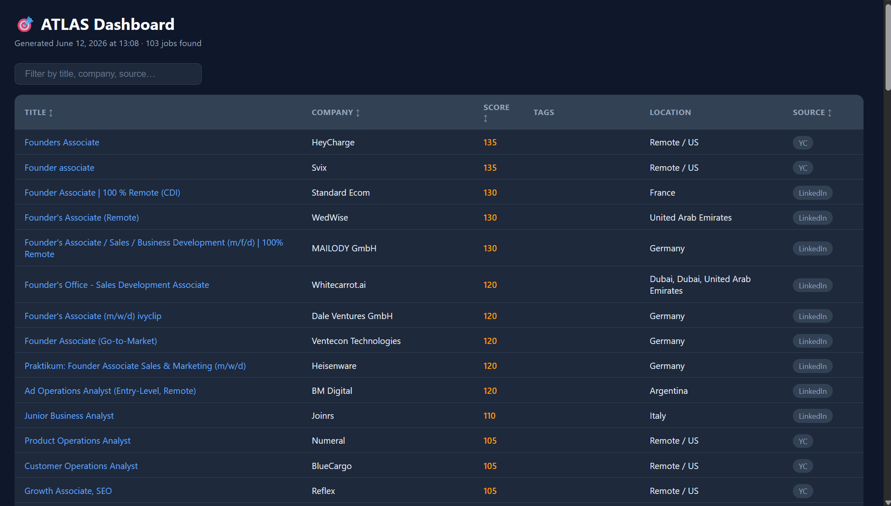
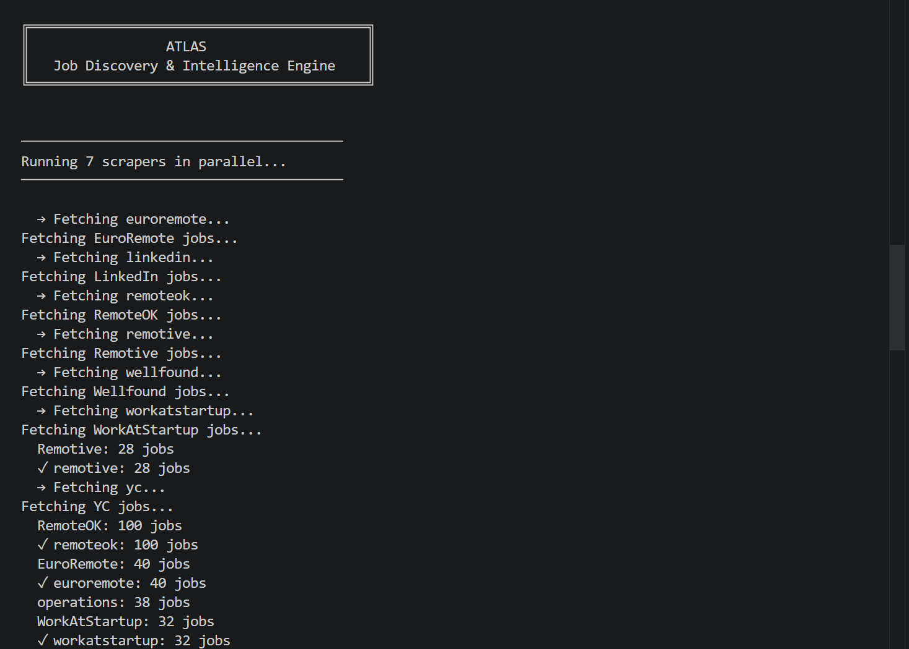

# ATLAS

### Job Discovery & Intelligence Engine

ATLAS is a multi-source job discovery and intelligence engine that aggregates opportunities from multiple job boards, removes duplicates, ranks opportunities based on relevance, and generates an interactive dashboard for faster job discovery.

Instead of manually searching across multiple platforms, ATLAS automatically collects, filters, ranks, and surfaces the highest-fit opportunities in a single place.

---

## Preview

### Interactive Dashboard



### Terminal Execution



---

## Why ATLAS?

Finding relevant opportunities often requires checking multiple job boards individually, leading to duplicated effort and missed opportunities.

ATLAS automates the entire discovery workflow by aggregating opportunities from multiple sources, removing duplicates, ranking opportunities based on relevance, and generating a centralized dashboard for rapid review.

---

## Features

* Multi-source job aggregation
* Parallel scraper execution
* Automatic deduplication (by URL and normalized title + company)
* Relevance-based job scoring
* Interactive HTML dashboard with search and sorting
* CSV export for further analysis
* Modular scraper architecture
* Easy source expansion

---

## Sources

ATLAS currently aggregates opportunities from:

* Y Combinator Jobs
* WorkAtAStartup
* Wellfound
* LinkedIn
* Remotive
* RemoteOK
* EuroRemoteJobs

---

## How It Works

```text
Discover Jobs
      ↓
Aggregate Results
      ↓
Deduplicate Listings
      ↓
Filter Low-Relevance Roles
      ↓
Rank Opportunities
      ↓
Generate Dashboard & CSV
```

---

## Installation

### 1. Clone the repository

```bash
git clone https://github.com/MaitreyaPathak/ATLAS.git
cd ATLAS
```

### 2. Create a virtual environment (recommended)

```bash
python -m venv venv
venv\Scripts\activate      # Windows
source venv/bin/activate   # macOS / Linux
```

### 3. Install dependencies

```bash
pip install -r requirements.txt
```

### 4. Install Playwright browser

```bash
playwright install chromium
```

---

## Usage

Run all scrapers:

```bash
python jobs.py
```

Run a specific source:

```bash
python jobs.py remotive
python jobs.py linkedin
python jobs.py yc
python jobs.py wellfound
python jobs.py workatstartup
python jobs.py remoteok
python jobs.py euroremote
```

---

## Outputs

ATLAS generates two files in the project root:

| File         | Description                                      |
| ------------ | ------------------------------------------------- |
| `atlas_opportunities.csv`   | Structured dataset of ranked opportunities       |
| `atlas_dashboard.html`  | Interactive dashboard with sortable job listings |

The dashboard provides:

* Clickable job links
* Source tracking
* Company information
* Relevance scores
* Location details
* Live search and column sorting

---

## Ranking Engine

ATLAS uses a configurable relevance-ranking engine to prioritize opportunities based on job-title relevance and career objectives.

Rather than treating all openings equally, the system evaluates opportunities using weighted keyword matching, seniority filters, and source-quality bonuses.

This allows the engine to be tailored for different career paths such as business, strategy, operations, product, growth, venture, or founder's office roles.

---

## Customization

ATLAS is designed to be adaptable to different job-search goals. The scoring framework lives entirely in `sources/scoring.py`.

To customize:

* **`PRIORITY_KEYWORDS`** — title phrases and their relevance weight
* **`BLOCK_KEYWORDS`** — roles to hard-reject (e.g. engineering, technical roles)
* **`SENIORITY_BLOCK`** — seniority levels to filter out (senior, director, etc.)
* **`FRESHER_SIGNALS`** — bonus keywords for entry-level / intern roles
* **`SOURCE_BONUS`** — extra points per source (e.g. YC and WorkAtStartup get a quality boost)
* **`description_blocks()`** — rejects jobs whose description mentions experience requirements (e.g. "5+ years")

### Example: Business & Strategy Focus

Prioritizes:
- Founder's Associate / Founder's Office
- Chief of Staff
- Business Analyst
- Strategy Analyst
- Venture Associate

### Example: Product Focus

Prioritizes:
- Product Analyst
- Associate Product Manager
- Product Operations
- Product Strategy

### Example: Operations Focus

Prioritizes:
- Operations Analyst
- Business Operations
- Program Associate
- Growth Operations

---

## Architecture

```text
ATLAS
│
├── jobs.py
├── requirements.txt
├── README.md
├── LICENSE
├── .gitignore
│
├── sources/
│   ├── __init__.py
│   ├── aggregator.py
│   ├── scoring.py
│   ├── remotive.py
│   ├── remoteok.py
│   ├── linkedin.py
│   ├── yc.py
│   ├── wellfound.py
│   ├── workatstartup.py
│   └── euroremote.py
│
└── screenshots/
    ├── atlas-dashboard.png
    └── atlas-terminal.png
```

---

## Technical Highlights

- Parallel scraper execution using `concurrent.futures`
- Cross-source job aggregation
- Duplicate detection and removal (URL + normalized title/company)
- Configurable relevance ranking with description-based filtering
- Automated HTML dashboard generation
- Extensible scraper architecture — drop a new file in `sources/` with a `fetch_jobs()` function

---

## Tech Stack

* Python
* Requests
* BeautifulSoup
* Playwright
* Feedparser
* Pandas

---

## Limitations

* **Scraping is inherently fragile.** Sites like LinkedIn, YC, and Wellfound change their HTML structure periodically. If a scraper suddenly returns 0 results, the site's layout likely changed and the selectors need updating.
* **Rate limiting.** LinkedIn and Wellfound may block or throttle requests if run too frequently. Avoid running the full scraper in a tight loop.
* **Playwright-based scrapers (YC, WorkAtStartup, Wellfound)** are slower and require Chromium to be installed via `playwright install chromium`.
* **No login/auth flows are used** — only publicly accessible pages are scraped.

---

## Roadmap

Future improvements:

* Configurable scoring profiles (multiple presets)
* User-defined role preferences via a config file
* Historical job tracking (avoid re-showing seen jobs)
* Email alerts for new high-score matches
* Dashboard analytics
* Additional job sources

---

## License

This project is licensed under the MIT License — see the [LICENSE](LICENSE) file for details.

---

## Disclaimer

ATLAS is an independent project and is not affiliated with any job board or company referenced by the scraper modules.

Data availability depends on third-party websites and APIs, and scraper reliability may vary as those sites change over time.
